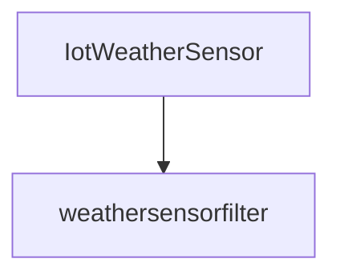

# BeFaaS IoT adapted to OpenFaaS (in a lean way)

Please use `DOCKER_BUILDKIT=1` when performing building action with docker

## Prepare the functions

```sh
faas-cli template pull --overwrite https://github.com/openfaas/templates
```

# FaaS setup with multipass
## Installation

Installs K3s
```sh
PUBLIC_SSH_KEY_PATH=$HOME/.ssh/id_rsa.pub PRIVATE_SSH_KEY_PATH=$HOME/.ssh/id_rsa ./minimal-k3s-multipass-bootstrap.sh
```

To move the kubeconfig file to then use `kubctl`:
```sh
cp kubeconfig ~/.kube/config
```

Installs openfaas on the cluster
```sh
arkade install openfaas
```

Install redis on the cluster
```sh
./longhorn.sh
kubectl apply -f redis
```


## Tunnel the connection with the gateway
```shell
kubectl port-forward -n openfaas svc/gateway 8080:8080
```

## Login to FaaS CLI
```sh
echo -n $(kubectl get secret -n openfaas basic-auth -o jsonpath="{.data.basic-auth-password}" | base64 --decode; echo) | faas-cli login --username admin --password-stdin
```

## Remove Everything
This is the *__nuke__* option, __finer grained could be better if you have other VMs running__
```sh
multipass delete --all --purge  
```

# Functions

Up all
```sh
for f in *.yml ; do faas-cli up -f $f; done
```


## Weathersensorfilter
```sh
curl http://127.0.0.1:8080/function/weathersensorfilter -d '{     "temperature_celsius": 25.4,     "humidity_percent": 70.0,     "wind_kph": 10.0,     "rain": false     }'
```

