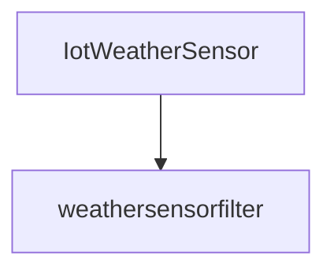

---
title: "Application samples"
author: [Volodia PAROL-GUARINO]
date: "\\today \\space-- v##VERSION##"
header-includes:
  - "\\usepackage{utf8}"
titlepage: true
...


# Lean IoT application

Inspiration taken from BeFaaS

## Prepare the functions

```sh
faas-cli template pull --overwrite https://github.com/openfaas/templates
```

# FaaS setup with multipass
## Installation

Installs K3s
```sh
PUBLIC_SSH_KEY_PATH=$HOME/.ssh/id_rsa.pub PRIVATE_SSH_KEY_PATH=$HOME/.ssh/id_rsa ./minimal-k3s-multipass-bootstrap.sh
```

To move the kubeconfig file to then use `kubctl`:
```sh
cp kubeconfig ~/.kube/config
```

Installs openfaas on the cluster
```sh
arkade install openfaas
```

Install redis on the cluster
```sh
./longhorn.sh
kubectl apply -f redis
```


## Tunnel the connection with the gateway
```shell
kubectl port-forward -n openfaas svc/gateway 8080:8080
```

## Login to FaaS CLI
```sh
echo -n $(kubectl get secret -n openfaas basic-auth -o jsonpath="{.data.basic-auth-password}" | base64 --decode; echo) | faas-cli login --username admin --password-stdin
```

## Remove Everything
This is the *__nuke__* option, __finer grained could be better if you have other VMs running__
```sh
multipass delete --all --purge  
```

# FaaS setup with Grid'5000

## Connection

```sh
ssh $USER@acccess.grid500.fr
ssh rennes
```

## Reserver resources

First start the session for 1 hour:
```sh
oarsub -l core=1 -i ~/.ssh/id_rsa "sleep infinity"
```

Then take the returned `job_id` and connect interactively to it
```sh
export JOBID=??
oarsub -C $JOB_ID
```

> To kill `oardel $OAR_JOB_ID`

```sh
nano ~/.ssh/config

# and inside
Host *.g5koar
 ProxyCommand ssh $(whoami)@access.grid5000.fr -W "$(basename %h .g5koar):%p"
 User oar
 Port 6667
 IdentityFile ~/.ssh/id_rsa
 ForwardAgent no
```

```sh
curl -sLS https://get.k3sup.dev | sh 
install k3sup /usr/local/bin/
export RESERVED_NODE=paravance-14
export SITE=rennes
export OAR_JOB_ID=??
export context="k3s-cluster" && export MASTER_IP="$RESERVED_NODE.$SITE.g5koar" && ./k3sup install --ip 1.1.1.1 --context $context --user $(whoami) --ssh-key  $HOME/.ssh/id_rsa
```

```sh
mkdir bin
ln -s /usr/bin/oarsh ~/bin/ssh
export PATH=$HOME/bin:$PATH
oarsub -l core=1 "sleep infinity"
oarsub -C $OAR_JOB_ID
```

```
oarsub "sleep infinity"
oarsub -C $OAR_JOB_ID
sudo-g5k
curl -sLS https://get.k3sup.dev | sh 
sudo cp k3sup /usr/local/bin/k3sup
export context="k3s-cluster" 
k3sup install --context $context --user $(whoami) --local
curl -SLsf https://get.arkade.dev/ | sudo sh
arkade get faas-cli
arkade install openfaas
export KUBECONFIG=~/kubeconfig
```

## Installation

# Functions

Up all
```sh
for f in *.yml ; do faas-cli up -f $f; done
```


## Weathersensorfilter
```sh
curl http://127.0.0.1:8080/function/weathersensorfilter -d '{     "temperature_celsius": 25.4,     "humidity_percent": 70.0,     "wind_kph": 10.0,     "rain": false     }'
```

