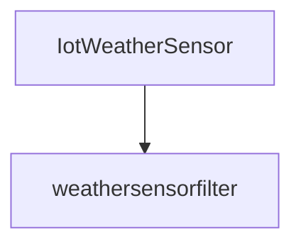

---
title: "Application samples"
author: [Volodia PAROL-GUARINO]
date: "\\today \\space-- v##VERSION##"
header-includes:
  - "\\usepackage{utf8}"
titlepage: true
...


# About

This repository contains a collection of functions ready to be deployed on an OpenFaaS Fog infrastructure.

# Installation

## Install Locally (with multipass)

### Requirements

- Arkade `curl -SLsf https://get.arkade.dev/ | sudo sh`
- Docker
- Helm `curl https://raw.githubusercontent.com/helm/helm/main/scripts/get-helm-3 | bash`
- K3sup `curl -sLS https://get.k3sup.dev | sh `
- Kubectl
- Multipass `sudo snap install multipass`

### Installation

Installs K3s
```sh
PUBLIC_SSH_KEY_PATH=$HOME/.ssh/id_rsa.pub PRIVATE_SSH_KEY_PATH=$HOME/.ssh/id_rsa ./minimal-k3s-multipass-bootstrap.sh
```

To move the kubeconfig file to the local computer config using `kubctl`:
```sh
cp kubeconfig ~/.kube/config
```

Installs openfaas on the cluster
```sh
arkade install openfaas
```

Install redis on the cluster, backed by longhorn-class storage
```sh
./longhorn.sh
kubectl apply -f redis
```

### Removal
This is the *__nuke__* option, __finer grained could be better if you have other VMs running__
```sh
multipass delete --all --purge  
```

## Install on Grid'5000 (interactive)

### Connection

`$USER` represents your grid'5000 account name
```sh
ssh $USER@acccess.grid500.fr
ssh rennes
```

### Installation

Get an interactive machine for an hour:
```sh
oarsub "sleep infinity"
oarsub -C $OAR_JOB_ID
```

Enable the use of `sudo` for the rest of the session
```sh
sudo-g5k
```

Install all the good stuff
```sh
curl -sLS https://get.k3sup.dev | sh 
sudo cp k3sup /usr/local/bin/k3sup
export context="k3s-cluster" 
k3sup install --context $context --user $(whoami) --local

curl -SLsf https://get.arkade.dev/ | sudo sh
curl https://raw.githubusercontent.com/helm/helm/main/scripts/get-helm-3 | bash
arkade get faas-cli
arkade install openfaas

mv ~/kubeconfig ~/.kube/kubeconfig
export KUBECONFIG=~/.kube/kubeconfig

curl -SLS https://raw.githubusercontent.com/VolodiaPG/fog_application_samples/main/longhorn.sh | bash
svn export https://github.com/volodiapg/fog_application_samples/trunk/redis redis
kubectl apply -f redis
```

### Removal

Killing the provisioned computing space is done via the CLI-frontend
```sh
oardel $OAR_JOB_ID
```

## Install on Grid'500 ([EnosLib](https://discovery.gitlabpages.inria.fr/enoslib/index.html))

# Usage

## Tunnel the connection with the gateway
```shell
kubectl port-forward -n openfaas svc/gateway 8080:8080
```

## Login to FaaS CLI
```sh
echo -n $(kubectl get secret -n openfaas basic-auth -o jsonpath="{.data.basic-auth-password}" | base64 --decode; echo) | faas-cli login --username admin --password-stdin
```

## Other utilities

To overwrite current templates
```sh
faas-cli template pull --overwrite https://github.com/openfaas/templates
```

# Functions

Up all
```sh
for f in *.yml ; do faas-cli up -f $f; done
```


## Weathersensorfilter
```sh
curl http://127.0.0.1:8080/function/weathersensorfilter -d '{     "temperature_celsius": 25.4,     "humidity_percent": 70.0,     "wind_kph": 10.0,     "rain": false     }'
```

# Acknowledgments

Inspiration taken from [BeFaaS](https://github.com/Be-FaaS/BeFaaS-framework)

