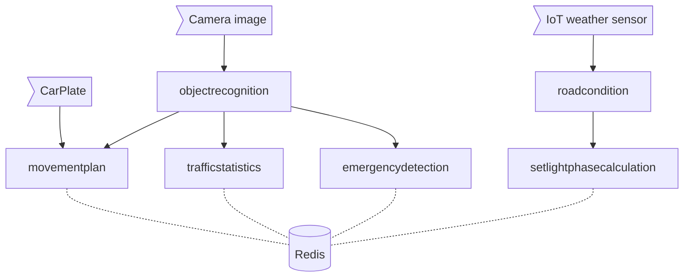

<!-- <h1 align="center">
  <a href="https://github.com/volodiapg/faas_fog">
    
  </a>
</h1> -->

<div align="center">
  <h1>
    FaaS Fog — Using functions and auctions for a sustainable Fog model
  </h1>
  <h2>
  Function placement for FaaS applications in the Fog​
  </h2>
  <!-- <br />
  <br />
  <a href="">Report a Bug</a>
  ·
  <a href="">Request a Feature</a>
  .
  <a href="">Ask a Question</a> -->
</div>

<div align="center">
<br />

[](LICENSE)

[](https://github.com/volodiapg)

</div>

<details open="open">
<summary>Table of Contents</summary>

- [About](#about)
  - [Built With](#built-with)
- [Getting Started](#getting-started)
  - [Overview](#overview)
  - [Prerequisites](#prerequisites)
  - [Usage with Grid'5000](#usage-with-grid5000)
  - [functions](#functions)
- [Contributing](#contributing)
- [License](#license)
- [Acknowledgements](#acknowledgements)

</details>

---

## About

<table>
<tr>
<td>

Function-as-a-Service (FaaS) applications could harness the disseminated nature of the Fog and take advantage of Fog’s benefits, such as real-time processing and reduced bandwidth. The FaaS programming paradigm allows applications to be divided in independent units called “functions.” However, deciding how to place those units in the Fog is challenging. Fog contains diverse, potentially resource-constrained nodes, geographically spanning from Cloud to the network edges. These nodes must be efficiently shared between the multiple applications that will require to use the Fog.

We introduce “Fog node ownership,” a concept where Fog nodes are owned by different actors that chose to give computing resources in exchange for remuneration. This concept allows for the reach of the Fog to be dynamically extended without central supervision from a unique decision taker, as currently considered in the literature. For the final user, the Fog appears as a single unified FaaS platform. We use auctions to incentivize Fog nodes to join and compete for executing functions.


Our auctions let Fog nodes independently put a price on candidate functions to run. It introduces the need of a “Marketplace,” a trusted third party to manage the auctions. Clients wanting to run functions communicate their requirements using Service Level Agreements (SLA) that provide guarantees over allocated resources or the network latency. Those contracts are propagated from the Marketplace to a node and relayed to neighbors.

Key features of **our work**:

- Standard stack (Kubernetes, OpenFaaS)
- Efficient programming in Rust
- Functions to deploy
- [Grid'5000](https://www.grid5000.fr/w/Grid5000:Home) support thanks to [EnosLib](https://discovery.gitlabpages.inria.fr/enoslib/)

<details open>
<summary>Additional info</summary>
<br>

This project has been started as an internship sponsored as I was a student from National Institute of Applied Sciences Rennes (INSA Rennes) and a second master (SIF) under University of Rennes 1, University of Southern Brittany (UBS), ENS Rennes, INSA Rennes and CentraleSupélec.

A thesis is being financed to pursue the work.

</details>

</td>
</tr>
</table>

### Built With

- Rust
- Kubernetes (K3S)
- OpenFaaS
- EnosLib

## Getting Started

This repo uses extensively [`just`](https://github.com/casey/just) as a powerful CLI facilitator.

### Overview

Here is an overview of the content of this repo:

```shell
.
├── enos # Contain EnosLib code to interact with Grid'5000 (build + deployment of live environment at true scale)
├── manager # contain the code of the marketplace and the fog_node
├── openfaas-functions # contain code of Fog FaaS functions
└── scripts # various scripts (maybe outdated)
```

### Prerequisites

Use your favorite IDE (CLion, etc.) supporting Rust.

`cargo build` usually is a good start.

Once up and running, the REST API is viewable as the root of the webserver ("127.0.0.1:3030/index.html") thanks to openAPI v3.

### Usage with Grid'5000

Most of the deployment process has now been streamlined to Grid5000 using [EnosLib](https://gitlab.inria.fr/discovery/enoslib) as the simplification vector.

As this section is deeply linked with the evaluation process, documentation changes often. Most of the process can be described by reading the CLI help of the scripts living in `node/manager/experiments/`.

Then to create a Grid5000 profile consider using the `init` verb

And to reserve the cluster to then execute use the verb: `up` (respectively `clean` to deallocate and free the nodes).

Another script that builds the docker images used in k8s is available under `/build`.

> When installing locally, the project is behaving like a standard Rust project, and follows the Clean Web Architecture: (REST API talks to services implementing behaviors that talks to repositories translating the calls to specific instructions to OpenFaaS, etc.)

<details>
<summary>Deprecated methods</summary>
<br>

### Install Locally (with multipass) (deprecated)

#### Requirements

- Arkade `curl -SLsf https://get.arkade.dev/ | sudo sh`
- Docker
- Helm `curl https://raw.githubusercontent.com/helm/helm/main/scripts/get-helm-3 | bash`
- K3sup `curl -sLS https://get.k3sup.dev | sh`
- Kubectl
- Multipass `sudo snap install multipass`

#### Installation

Installs K3s
```sh
PUBLIC_SSH_KEY_PATH=$HOME/.ssh/id_ed25519.pub PRIVATE_SSH_KEY_PATH=$HOME/.ssh/id_ed25519 ./scripts/minimal-k3s-multipass-bootstrap.sh
```

To move the kubeconfig file to the local computer config using `kubctl`:
```sh
cp kubeconfig ~/.kube/config
```

> Careful if you have multiple instances running on the same computer

Installs openfaas on the cluster
```sh
arkade install openfaas
```

Install redis on the cluster, backed by longhorn-class storage (you may have to wait a bit to apply redis after the creation of the longhorn storage-class)
```sh
./scripts/longhorn.sh
kubectl apply -f redis
```

#### Removal
This is the *__nuke__* option, __finer grained could be better if you have other VMs running__
```sh
multipass delete --all --purge  
```

### Install on Grid'5000 (interactive) (deprecated)

#### Connection

`$USER` represents your grid'5000 account name
```sh
ssh $USER@access.grid5000.fr
ssh rennes
```

#### Installation

Get an interactive machine for an hour:
```sh
oarsub "sleep infinity" | bash
echo $OAR_JOB_ID
oarsub -C $OAR_JOB_ID
```

Enable the use of `sudo` for the rest of the session
```sh
sudo-g5k
```

Install all the good stuff
```sh
curl -sLS https://get.k3sup.dev | sh 
sudo cp k3sup /usr/local/bin/k3sup
export context="k3s-cluster" 
k3sup install --context $context --user $(whoami) --local
export KUBECONFIG=/home/$(whoami)/kubeconfig
kubectl config set-context $context
kubectl get node -o wide

curl -SLsf https://get.arkade.dev/ | sudo sh
sudo mv /home/voparolguarino/.arkade/bin/faas-cli /usr/local/bin/
curl https://raw.githubusercontent.com/helm/helm/main/scripts/get-helm-3 | bash
arkade get faas-cli
#arkade install openfaas
curl -sSL https://cli.openfaas.com | sudo -E sh

# mv ~/kubeconfig ~/.kube/kubeconfig
# export KUBECONFIG=~/.kube/kubeconfig

# curl -SLS https://raw.githubusercontent.com/VolodiaPG/faas_fog/main/longhorn.sh | bash
# svn export https://github.com/volodiapg/faas_fog/trunk/redis redis
# kubectl apply -f redis
```

#### Removal

Killing the provisioned computing space is done via the CLI-frontend
```sh
oardel $OAR_JOB_ID
```

#### One-liner install

```sh
curl -SLS https://raw.githubusercontent.com/VolodiaPG/faas_fog/stub-backends/scripts/grid5000.sh | bash
```

</details>

## Functions

### Up all
```sh
./scripts/all.sh
```
### Architecture



## Contributing

Please contact me from the info in my [GitHub profile](https://github.com/volodiapg).

## License

This project is licensed under the **MIT license**.

See [LICENSE](LICENSE) for more information.

## Acknowledgements

Thanks for these awesome resources that were used during the development of this project

- for the functions taken from [BeFaaS](https://github.com/Be-FaaS/BeFaaS-framework)
